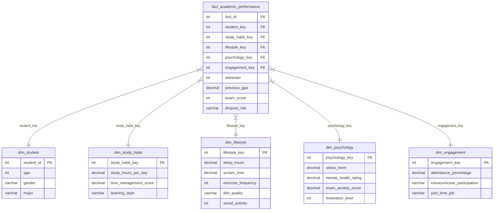

# Pembahasan Sistem Business Intelligence: Studlytics

Dokumen ini menjelaskan arsitektur teknis dan rancangan sistem Business Intelligence (BI) **Studlytics** untuk menganalisis dan memprediksi kinerja akademik serta risiko dropout mahasiswa.

---

## 1. Dataset yang Digunakan
Sistem ini menggunakan dataset **`enhanced_student_habits_performance_dataset.csv`** yang berisi profil perilaku harian dan prestasi akademik mahasiswa. Kolom-kolom utama dalam dataset ini meliputi:
*   **Identitas & Profil**: `student_id`, `age`, `gender`, `major` (Program Studi).
*   **Kebiasaan Belajar**: `study_hours_per_day` (jam belajar/hari), `time_management_score` (skor manajemen waktu 1-10), `learning_style` (gaya belajar).
*   **Gaya Hidup**: `sleep_hours` (jam tidur/hari), `screen_time` (jam penggunaan gawai), `exercise_frequency` (frekuensi olahraga/minggu), `diet_quality` (kualitas diet), `social_activity` (frekuensi aktivitas sosial).
*   **Kondisi Psikologis**: `stress_level` (tingkat stres 1-10), `mental_health_rating` (rating kesehatan mental 1-10), `exam_anxiety_score` (skor kecemasan ujian 1-10), `motivation_level` (tingkat motivasi 1-10).
*   **Keterlibatan Akademik**: `attendance_percentage` (persentase kehadiran), `extracurricular_participation` (keikutsertaan ekskul), `part_time_job` (pekerjaan paruh waktu).
*   **Metrik Prestasi & Risiko (Fakta)**: `semester`, `previous_gpa` (IPK semester lalu), `exam_score` (nilai ujian), `dropout_risk` (status risiko putus kuliah: Yes/No).

---

## 2. Proses ETL (Extract, Transform, Load)
Proses ETL diimplementasikan menggunakan Python dalam berkas [etl_process.py](file:///c:/SEMESTER%206/BI/tb/student_bi_project/student_bi_project/etl_process.py) dengan memanfaatkan library `pandas`, `numpy`, `SQLAlchemy`, dan `scikit-learn`.

### A. Extract (Ekstraksi)
Membaca dataset mentah berformat CSV (`enhanced_student_habits_performance_dataset.csv`) menggunakan fungsi `pd.read_csv()` ke dalam objek Pandas DataFrame.

### B. Transform (Transformasi & Pembersihan)
Proses transformasi meliputi langkah-langkah penanganan kualitas data sebagai berikut:
1.  **Pembersihan Data Duplikat**: Menghapus baris duplikat menggunakan `drop_duplicates()` untuk menjaga konsistensi.
2.  **Penanganan Nilai Kosong (Imputasi Missing Values)**:
    *   Kolom numerik diisi menggunakan nilai **Median** dari masing-masing kolom.
    *   Kolom kategorikal diisi menggunakan nilai **Modus** (nilai tersering muncul).
3.  **Penanganan Pencilan (Outliers)**:
    *   Menggunakan metode **Interquartile Range (IQR)** pada atribut kondisi psikologis (`stress_level`, `mental_health_rating`, `exam_anxiety_score`, `motivation_level`).
    *   Nilai pencilan di-clip (dipangkas) agar tetap berada di dalam rentang batas bawah ($Q1 - 1.5 \times IQR$) dan batas atas ($Q3 + 1.5 \times IQR$).
4.  **Normalisasi & Standardisasi Data (Scikit-Learn)**:
    *   **MinMaxScaler** digunakan untuk menormalisasi kolom numerik umum (`study_hours_per_day`, `time_management_score`, dll.) ke dalam skala $[0, 1]$ untuk model prediksi.
    *   **StandardScaler** digunakan untuk menstandardisasi kolom numerik gaya hidup (`sleep_hours`, `screen_time`, dll.) ke bentuk distribusi standar (Z-score).
5.  **Validasi Konsistensi Data**:
    *   Menggunakan pernyataan `assert` untuk memastikan seluruh nilai berada di rentang logika (contoh: IPK di antara 0.0–4.0, kehadiran di antara 0%–100%, nilai ujian di antara 0–100).

### C. Load (Pemuatan)
Data yang telah dibersihkan dimuat ke basis data relasional MySQL (`student_performance_db`) dengan langkah:
1.  Menjalankan perintah `TRUNCATE` pada tabel fakta dan tabel dimensi untuk menghindari redundansi data saat muat ulang.
2.  Memasukkan data ke masing-masing tabel dimensi secara terpisah.
3.  Melakukan mapping surrogate keys (kunci buatan) otomatis secara 1-ke-1 untuk menghubungkan tabel dimensi dengan tabel fakta.
4.  Memuat data fakta utama beserta Foreign Keys (kunci tamu) terkait ke dalam tabel fakta.

---

## 3. Desain Skema Data Mart (Star Schema)
Data Mart dirancang menggunakan skema bintang (**Star Schema**) untuk mengoptimalkan performa kueri analisis visualisasi BI. Skema ini terdiri dari 5 tabel dimensi dan 1 tabel fakta (dapat dilihat pada berkas [data_mart.sql](file:///c:/SEMESTER%206/BI/tb/student_bi_project/student_bi_project/data_mart.sql)):

---

## 4. Tampilan Dashboard & Aspek Teknis (Streamlit)
Dashboard visualisasi interaktif dibangun menggunakan library **Streamlit** ([app.py](file:///c:/SEMESTER%206/BI/tb/student_bi_project/student_bi_project/app.py)) dengan integrasi database MySQL (menggunakan SQLAlchemy) serta fallback otomatis ke berkas CSV lokal apabila server MySQL offline.

### A. Fitur Navigasi & Filter Global
*   **Navigasi Sidebar**: Berisi menu perpindahan halaman analisis yang didekorasi dengan gaya kartu glassmorphic berpendar.
*   **Status Database**: Indikator LED kustom berkedip (pulse animation) yang menunjukkan status konektivitas basis data MySQL (Aktif/Offline).
*   **Filter Global**: Filter dinamis berdasarkan Program Studi (Major), Jenis Kelamin, dan Semester yang langsung memengaruhi data visualisasi pada Halaman 1-4 secara *real-time*.

### B. Halaman Analisis
1.  **Executive Summary**: Menampilkan ringkasan metrik penting (GPA, Exam Score, Dropout Rate, Kehadiran, Jam Belajar) lewat **KPI Cards** dengan ikon SVG kustom, grafik distribusi histogram GPA & Ujian, pie chart rasio risiko dropout, dan horizontal bar chart nilai program studi terbaik.
2.  **Study Habits Analysis**: Menganalisis korelasi jam belajar dan skor manajemen waktu terhadap GPA menggunakan scatter plot dengan tren regresi linear (OLS), visualisasi bar kategori waktu belajar, serta matriks korelasi kebiasaan akademik.
3.  **Lifestyle & Psychology Analysis**: Menganalisis pengaruh waktu tidur, penggunaan gawai, frekuensi olahraga, tingkat stres (box plot), kesehatan mental, dan kecemasan ujian terhadap kinerja akademik mahasiswa.
4.  **Engagement & Risk Analysis**: Menganalisis pengaruh persentase kehadiran kuliah dan keaktifan kegiatan ekstrakurikuler terhadap nilai serta risiko putus sekolah mahasiswa.
5.  **Predictive Analytics (ML)**: Form interaktif bertab untuk memasukkan parameter profil mahasiswa secara terstruktur guna memprediksi status risiko dropout.

### C. Teknologi Model Machine Learning (ML)
Pada Halaman 5 (ML), klasifikasi risiko dropout menggunakan algoritma **Decision Tree Classifier** (`scikit-learn`):
*   **Fitur Prediktor**: Jam belajar, manajemen waktu, waktu tidur, penggunaan gawai, frekuensi olahraga, tingkat stres, kesehatan mental, kecemasan ujian, persentase kehadiran, dan partisipasi ekstrakurikuler.
*   **Pelatihan Model**: Model dilatih secara langsung saat aplikasi dimuat (`@st.cache_resource`) dengan kedalaman pohon maksimal 5 (`max_depth=5`) untuk mencegah overfitting.
*   **Desain Output**: Hasil prediksi ditampilkan dalam bentuk **Result Card** kustom dengan warna merah menyala (High Risk) atau hijau emerald (Low Risk), lengkap dengan rekomendasi intervensi terstruktur bagi dosen pembimbing akademik.
